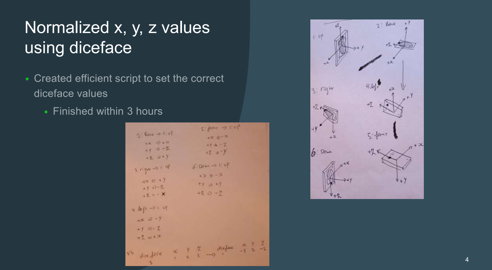
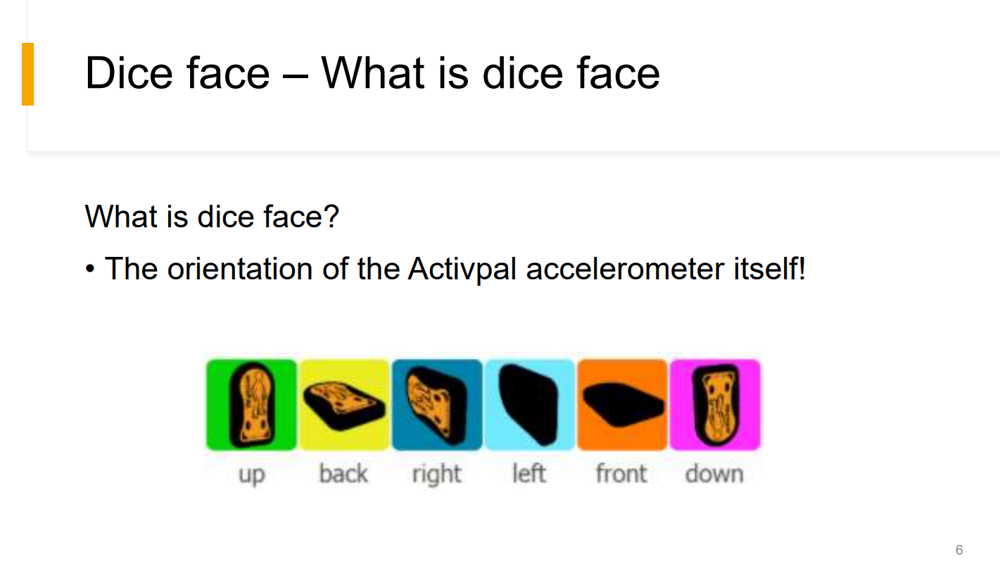
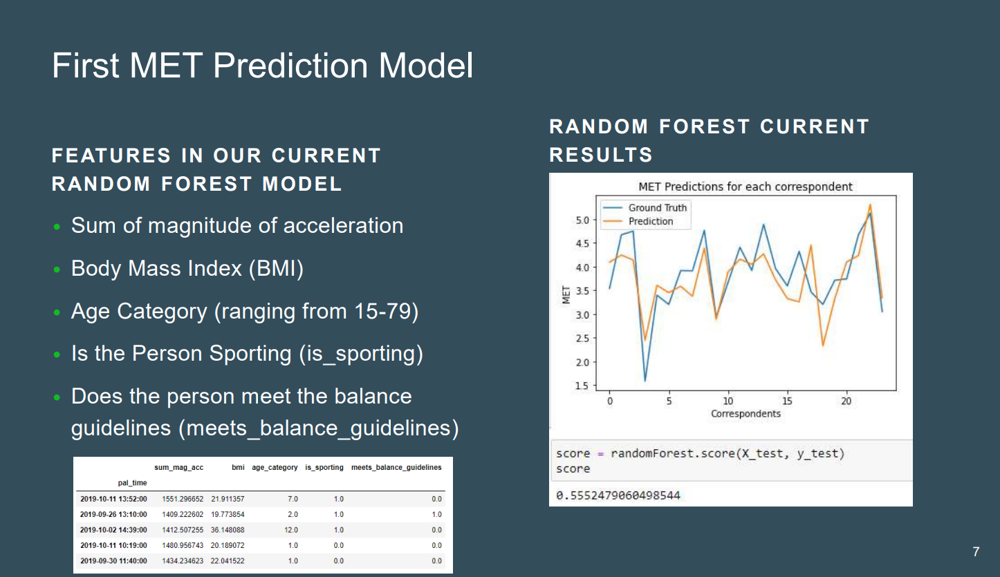
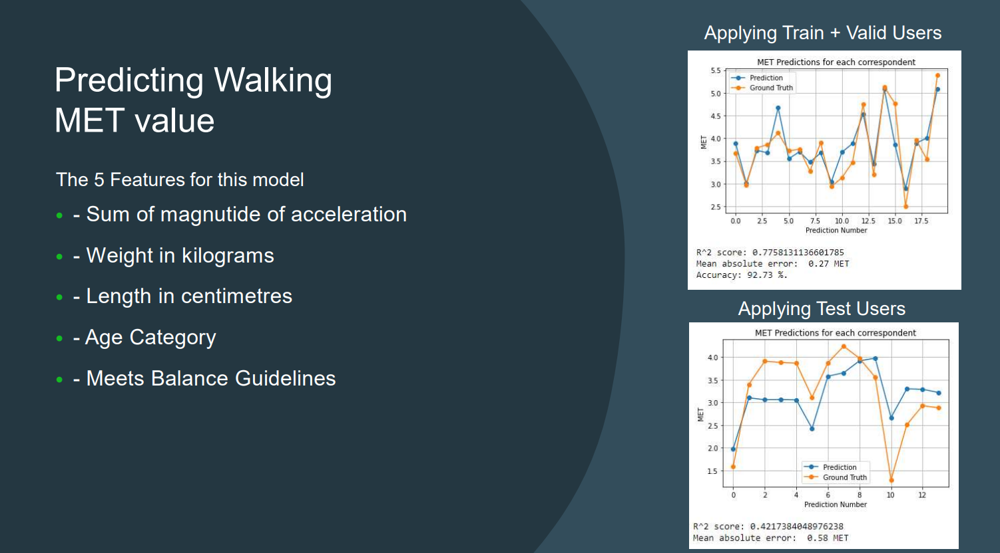
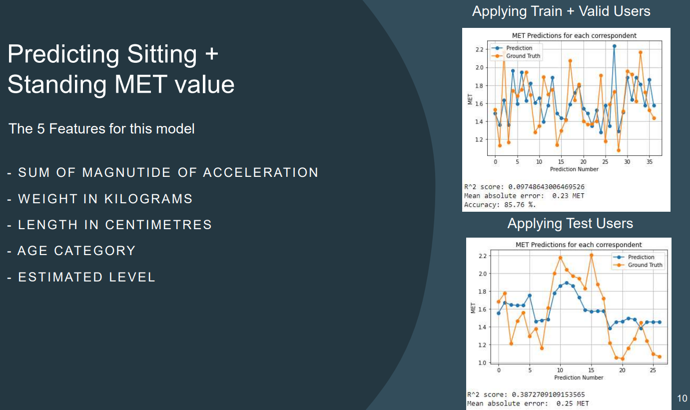

# Presentations
In this chapter I will describe which presentations I've contributed to and which I presented.
Since the content of the first 5 presentations was not that useful and informative I decided to leave them out of here. 

#### [Presentation #6 — PDF](../Images/Presentation%20Week%206.pdf)

My contributions for Presentation #6

 
Slide 7

 
Slide 10

#### [Presentation #7 — PDF](../Images/Presentation%20Week%207.pdf)

My contributions for Presentation #7

 
Slide 4

#### [Presentation #8 — PDF](../Images/External Presentation 2 Week 8.pdf)

My contributions for Presentation #8

 
Slide 6

#### [Presentation #9 — PDF](../Images/Presentation%20Week%209.pdf)

My contributions for Presentation #9

 
Slide 6

 
Slide 7

#### [Presentation #10 — PDF](../Images/Presentation%20Week%2010.pdf)

My contributions for Presentation #10

 
Slide 6

 
Slide 7

 
Slide 8

 
Slide 9

 
Slide 10

#### [Presentation #11 — PDF](../Images/Presentation%20Week%2011.pdf)

My contributions for Presentation #11

 
Slide 7

 
Slide 10

#### [Presentation #12 — PDF](../Images/External Presentation 2 Week 12.pdf)

My contributions for Presentation #12

 
Slide 7

 
Slide 10

#### [Presentation #13 — PDF](../Images/Presentation%20Week%20133.pdf)

My contributions for Presentation #13

 
Slide 7

 
Slide 10

#### [Presentation #14 — PDF](../Images/Presentation%20Week%2014.pdf)

My contributions for Presentation #14

 
Slide 7

 
Slide 10

#### [Presentation #15 — PDF](../Images/Presentation%20Week%2015.pdf)

My contributions for Presentation #15

 
Slide 7

 
Slide 10

[<  Go Back](../README.md)
