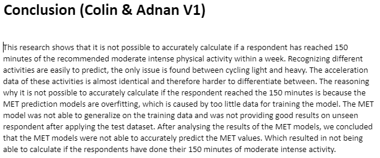
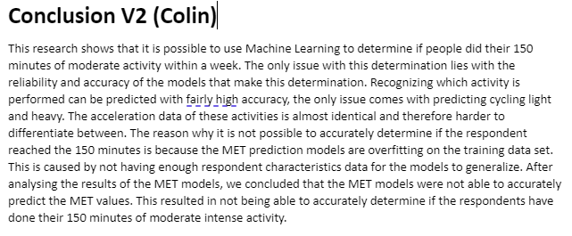
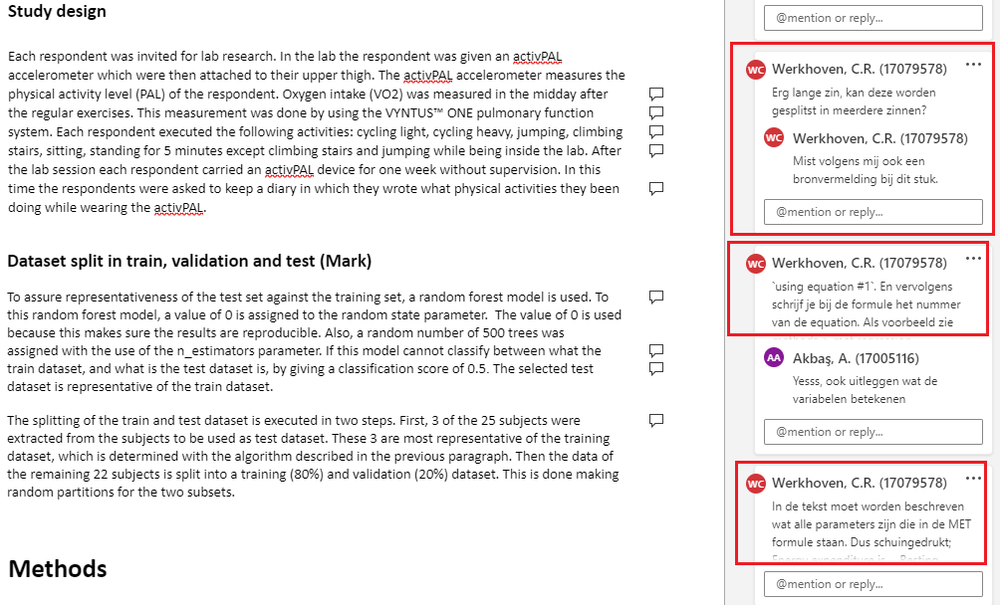
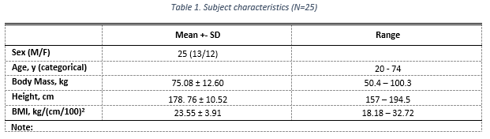

# Writing Paper

I started a bit later than the rest because I was still finishing the MET Regression Models. 

|Chapter|Contribution|Link/Example|
|------------|--------|--------|
|MET Regression Models V1 |This was part of the `methods` chapter. Here I wrote how the MET regression models were realised. Starting with data preparation, features engineering and finally training and evaluating the models.| [Find chapter here](../Images/Communication/met_regression_models_V1.pdf) (pdf opens) |
|MET Regression Models V2 |The most important feedback was about writing mathematical equations. This was processed during V2. | [Find chapter here](../Images/Communication/met_regression_models_V2.pdf) (pdf opens) |
|MET Regression Results V1 |This chapter was mainly about writing what the actual results are of the experiments. I wrote about what results are showing and how we got these results..| [Find chapter here](../Images/Communication/met_regression_results_V1.pdf) (pdf opens) |
|MET Regression Results V2 ||
|Conclusion V1 |The first conclusion was made with Adnan. We started with writing down the results and own conclusions of the models we both created. Afterwards we reviewed each others conclusions and came up with an overall conclusion. Resulting in an conclusion from 2 perspectives. |  |
|Conclusion V2 |After receive feedback on `Conclusion V1` I started with writing V2. Answering the main research question was not done concisely and certain conclusions were not strongly substantiated. While writing V2 I made sure these points were processed. ||
|Reviewing Team Members|There is no proof of actual reviewing besides the comments in the document. During the reviewing I tried to be very critical, even though we did not want to publish our research in an actual paper.|   |

---

While writing a research paper it is important to have visualizations and tables that follow the paper guidelines. I started researching how to create those tables. Here is an example of one of the research paper tables.

|Before|After|
|------------|--------|
|||

---

[<  Go Back](../README.md)