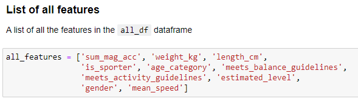
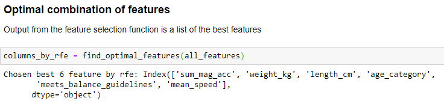
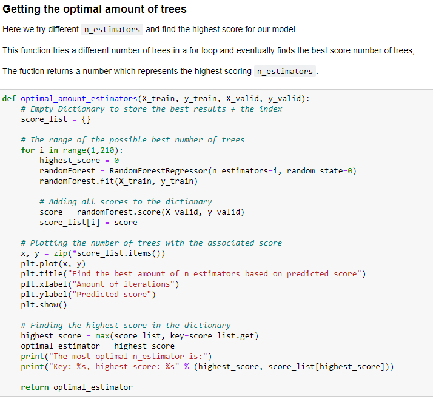
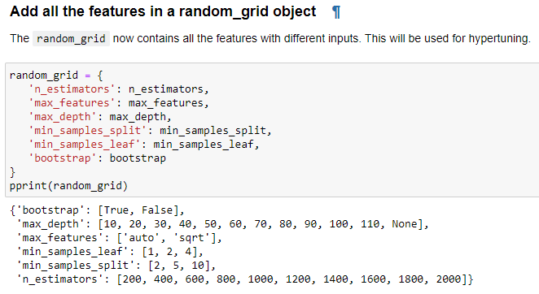

# Configuring a model

### Introduction

In the previous chapter we've picked 2 possible Regression models, Random Forest and XGBoost. I will discuss the configurations for both models here. Both models have almost the same configurations, I will therefor explain the configurations once. Here you can find a list of configurations that were applied by the configuration of both models. 

---

 
Random State

Picking a `random state` is essential for the configurations of your models. Without a `random_state`, the model will always apply a random, new variation of decision trees. To get accurate predictions and results it is important to always have the same decision trees. 

We decided to use `random_state=0` for all our MET prediction models. This way all models would have consistency in the configurations and results could not get manipulated by trying out different random state values. The decision for `random_state=0` is found [here](https://scikit-learn.org/stable/glossary.html#term-random-state). 

---

 
Feature Selection

After [preparing the MET prediction model dataframe](../Data%20Preprocessing/data_preparation.md) with different features I thought it would take a long time to try all possible variations. Therefor, I wanted to use Recursive Feature Selection [(RFE)](https://scikit-learn.org/stable/modules/generated/sklearn.feature_selection.RFE.html). 
RFE picks a combination with the best scoring features. The chosen features were used in the configuration of the Random Forest or XGBoost model. This automated approach would save us lots of time, since we needed to find features for 6 different activities and 2 different models.   

List of features for Feature Selection

Feature Selection Function

Example results of Feature Selection

---

 
Picking the best number of trees

The `n_estimators` parameter is an important configuration for all tree based models. Every number of tree results in a different outcome. I wanted to find the best number of trees, but doing this by hand was gonna take way too long. Therefor I decided to write a function that finds the optimal number of trees between a certain range. 
In our case we picked a range between 1-210. After analyzing the plots, the results were not getting higher with a larger number of trees around 200. 

Finding optimal number of trees function

The result from this function was used during the configuration of the models for the `n_estimators` parameter.

Results of the optimal number of trees function

More on the visualisation of this plot can be found in the [visualizing the outcome of a model chapter](visualizing_the_outcome_of_a_model.md).

---

 
Hyperparameter Tuning

Once the optimal amount of features and number of trees were selected it was time to improve the models even more. My colleague Adnan Akbas pointed me towards `Hyperparameter Tuning`.

##### What is Hyperparameter Tuning?

Hyperparameter tuning is finding the best combination of parameters for your Machine Learning model. 

Since the Random Forest and XGBoost models have some different configurations, I searched which parameters were usually tuned for each model. 

##### Parameters for the Random Forest model 

[Random Forest Hyperparameter Tuning Source](https://towardsdatascience.com/hyperparameter-tuning-the-random-forest-in-python-using-scikit-learn-28d2aa77dd74)

Here is a list of parameters and possible values that were tuned for the Random Forest model.

These parameters were applied with all possible combinations on a new `RandomForestRegressor` model. 

[<  Selecting a model](selecting_a_model.md) — [Training a model >](training_a_model.md) 