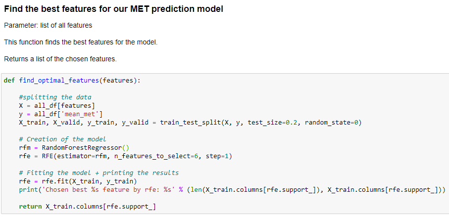

# Configuring a model

### Introduction

In the previous chapter we've picked 2 possible Regression models, Random Forest and XGBoost. I will discuss the configurations for both models here. Both models have almost the same configurations, I will therefor explain the configurations once. 

---

 
Random State

Picking a `random state` is essential for the configurations of your models. Without a `random_state`, the model will always apply a random, new variation of decision trees. To get accurate predictions and results it is important to always have the same decision trees. 

We decided to use `random_state=0` for all our MET prediction models. This way all models would have consistency in the configurations and results could not get manipulated by trying out different random state values. The decision for `random_state=0` is found [here](https://scikit-learn.org/stable/glossary.html#term-random-state). 

---

 
Feature Selection

After [preparing the MET prediction model dataframe](../Data%20Preprocessing/data_preparation.md) with different features we thought it would take a long time to try all possible variations. Therefor, we wanted to use Recursive Feature Selection [(RFE)](https://scikit-learn.org/stable/modules/generated/sklearn.feature_selection.RFE.html). 
RFE picks a combination with the best scoring features. The chosen features were used in the configuration of the Random Forest or XGBoost model. 

List of features for Feature Selection

Feature Selection Function

Example results of Feature Selection

---

 
Picking the best number of trees

Text here

Text here

---

 
Hyperparameter Tuning

Text here

Text here

[<  Selecting a model](selecting_a_model.md) — [Training a model >](training_a_model.md) 