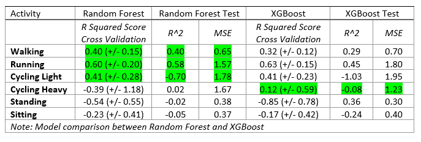

# Evaluating a model

### Introduction

As explained in [selecting a model](selecting_a_model.md), I decided to pick 2 different regression models to compare the results and select the right one for each activity. 
I used a few different methods to calculate prediction scores and eventually picked the most fitting. 

Cross Validation

The first method is calculated after applying K-Fold Cross Validation on the Random Forest & XGBoost model. I created a simple function that applies `5 folds` on both models and calculates the `mean` score and the `standard deviation (STD)`. These scores are compared for both model to find the most fitting for each activity.

Cross Validation Function

---

Applying Test Dataset

Once the Cross Validation had decent results we decided to apply the separated test dataset on our model to validate the results. 
The test dataset that was separated contained 3 test users with each containing 5 rows of data for each activity. I created a function to apply the test users on the already trained model to see if our model would over/under fit or give good results on new data.

Applying Test Dataset Function

 

---

Evaluation Results

Picking a fitting model for each activity was the final step once Cross Validation and the Test Dataset were applied. I created a table that displays the:
- `R Squared score after Cross Validation`
- `R^2  score after applying the test data set` 
- `Mean Squared Error (MSE) score after applying the test data set` 

Show Table

After evaluating the scores for both models we, as a team, picked the best scoring model for each activity. The models we picked are marked in green in the table bellow.

As you can see, `Standing` and `Sitting` are not marked. The reason for this is that we decided to leave the predictions for both out of the experiment since they would not impact the result of the main question. This has been agreed in consulation with Annemieke van Leuten and John Bolte from Centraal Bureau of Statistiek (CBS).

### Final Results

|Activity|Model|
|------------|---------|
|Walking|Random Forest|
|Running|Random Forest|
|Cycling Light|Random Forest|
|Cycling Heavy|XGBoost|

---

[<  Training a model](training_a_model.md) — [Visualizing the outcome of a model >](visualizing_the_outcome_of_a_model.md) 