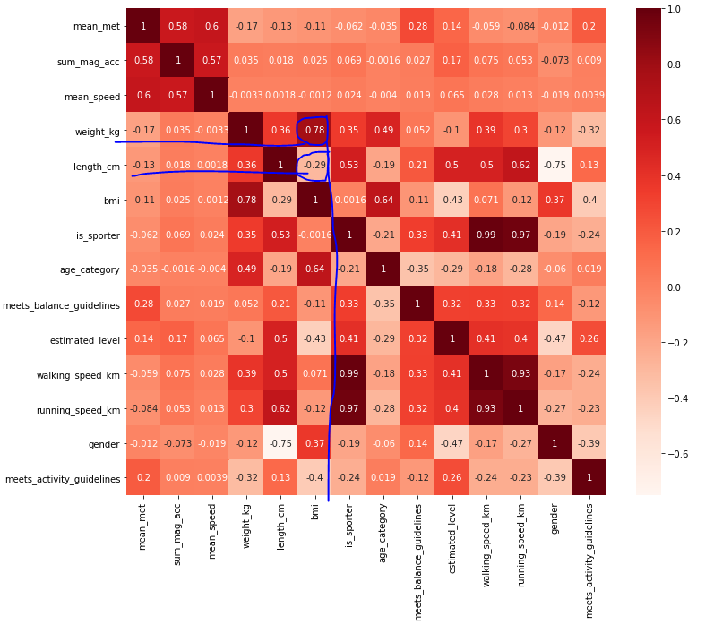

# Training a model

### Introduction

Training is model is an essential part of every Machine Learning model. It is important to find the correct balance to prevent overfitting or underfitting. 

Explanation of Hyperparameter tuning for the Random Forest and XGBoost model can be found [here](configuring_a_model.md).

Prevention of Under/Over fitting

Throughout the implementation of the MET prediction model we've encountered multiple obstacles. Here is a list of actions I took to prevent under/over fitting.

Removing Irrelevent Features

Removing Irrelevent or high correlating features was also used to prevent overfitting. Take the feature Body Mass Index (BMI) for example. This feature was created from the length and weight of the respondent. After analyzing the feature correlation heatmap I found that weight had a very high correlation with BMI. I decided to pick either length and weight or BMI. The final decision was to remove BMI as a feature.

Feature Correlation Heatmap

 

--- 

Creating Relevent Features

After struggling for a while and not getting higher correlations for the MET prediction models I thought about adding new relevant features. The speed of the respondent made sense in our case. Running or walking faster means you use more energy which results in a higher MET production. 
The implementation of the `speed` feature was a good choice, because our models all improved quiet a bit!

Removing Noise

The noise for the MET prediction models were usually respondents who weren't able to perform the lab activities according to the rest of the respondents. For example: 70+ year old respondents that could not complete the activities for the given time were excluded from the experiment. This has been agreed in consulation with Annemieke van Leuten and John Bolte from Centraal Bureau of Statistiek (CBS). 

---

First Run Training

text

---

Cross Validation Training

text

---

Applying Test Dataset

text

---

[<  Configuring a model](configuring_a_model.md) — [Evaluating a model >](evaluating_a_model.md) 