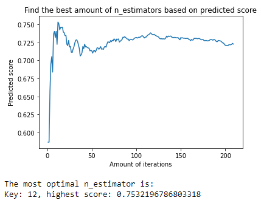

# Visualizing the outcome of a model

### Introduction

Informative and straight to the point visualization of your data is very important to make conclusion about what you're actually seeing. This chapter displays the different visualizations that were applied by the creation of the MET prediction models.

Seaborn Heatmap

The Seaborn library was used to create a Heatmap to display correlations between all the features. The use of this heatmap can be found in the [Training a model chapter](training_a_model.md).

This heatmap was used to see which features were low or high correlated to the `mean_met` target value. Looking at the correlations we could already see that `sum_mag_acc` and `mean_speed` were high correlating features and are probably good features the predict the `mean_met` value.

Finding optimal n_estimators line chart

The following visualization displays the scores from a certain range. I wanted to find the best amount of iterations for this model. In some cases the `n_estimator` value of 2 gave the best results, this would be unlikely so I decided to start from 10 instead of 1.
At first the amount of iterations was set to 100, but after analysing the results I saw that the scores were going up around the 100 mark. I decided to expand this to 200 to see if it went higher. 

[< Evaluating a model](evaluating_a_model.md)  — [README >](../README.md)