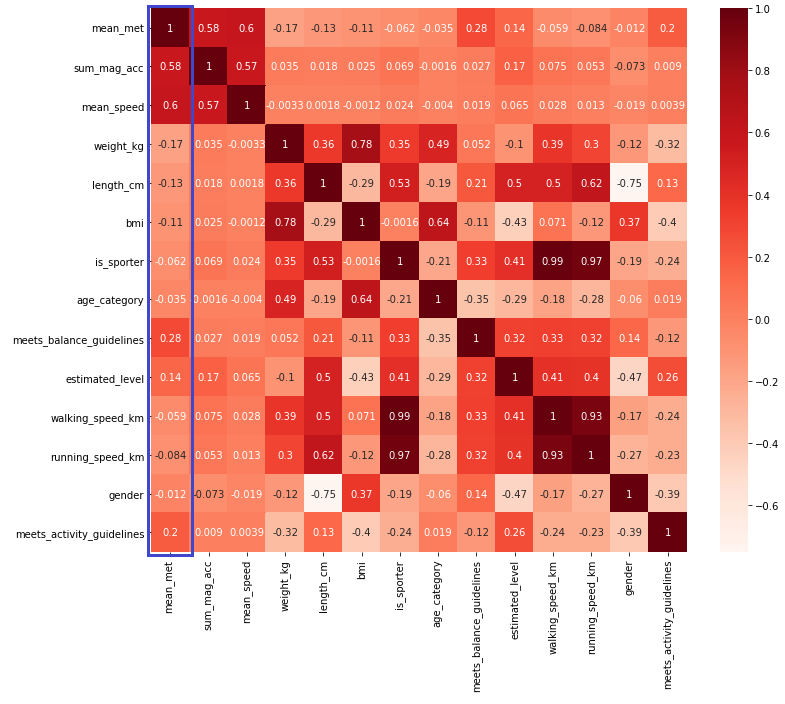

# Visualizing the outcome of a model

### Introduction

Informative and straight to the point visualization of your data is very important to make conclusion about what you're actually seeing. This chapter displays the different visualizations that were applied by the creation of the MET prediction models.

Seaborn Heatmap

The Seaborn library was used to create a Heatmap to display correlations between all the features. The use of a heatmap can be found in the [Training a model chapter](training_a_model.md).

This heatmap was used to see which features were low or high correlated to the `mean_met` target value. Looking at the correlations we could already see that `sum_mag_acc` and `mean_speed` were high correlating features and are probably good features the predict the `mean_met` value.

[< Evaluating a model](evaluating_a_model.md)  — [README >](../README.md)