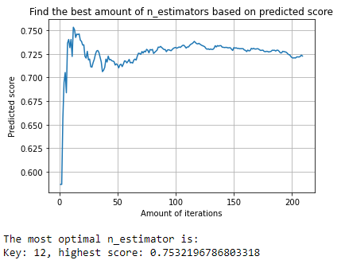
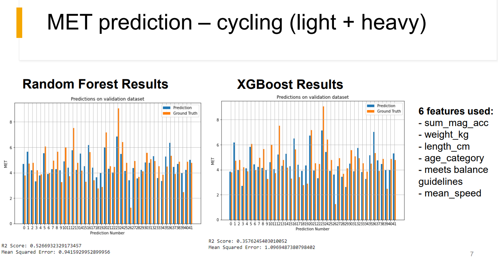
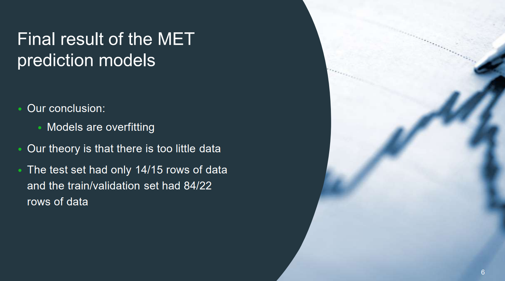
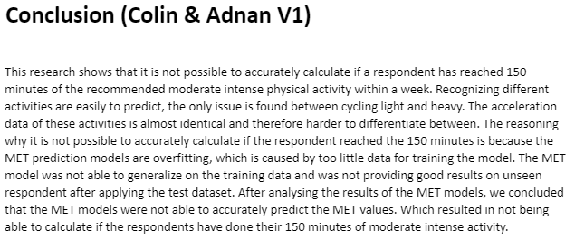
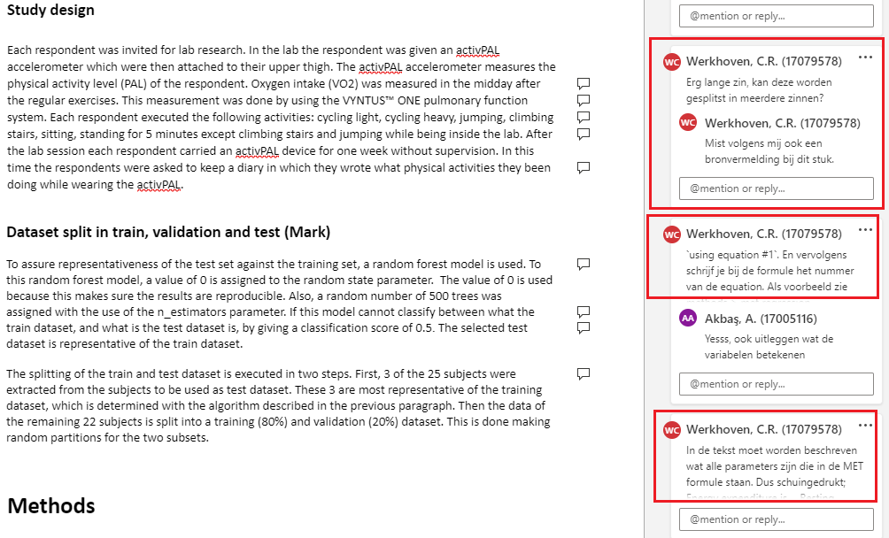
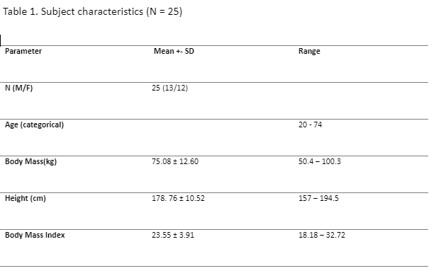
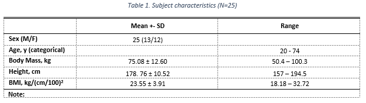

# activPAL Portfolio - Data Science Minor 
By: Colin Werkhoven 

Studentnumber: 17079578

Project group
- Adnan Akbas — [portfolio](https://github.com/klict/activepal-portfolio)
- Ali Safdari — 
- Matthew Turkenberg — 
- Mark Boon — 

#### *Note: I hope the portfolio isn't too extensive.*

# Introduction

Centraal Bureau van Statistiek wants to know if it is possible to apply Machine Learning to determine if people have done their 150 minutes of moderate intense activities within a week. This research will find out if it is possible to make these calculations with the application of different Machine Learning models. 

# Datacamp Courses

Progress in DataCamp can be found here

# Reflection and Evaluation

Reflection on own contribution to the project

##### Situation

This project is done during the COVID-19 pandemic and will therefore be completed in an online environment. This will bring some complications, but our team will figure out ways to make this work. 

Before starting this project I decided I wanted to work on my `leader` and `initiative` sides. This meant starting and leading standups and taking initiative to get in contact with teachers and CBS.  

##### Task
With my initiative to work on my leader role I found it important to know what every team member was doing. Besides knowing what my team members were doing I decided to work on new unknown things so I could share them with the other team members. 

##### Actions
During most standups I was asking a lot of questions to my team member about the process they made. Doing this gave me broader knowledge about the project and would be informative for the rest as well. 

I decided to start with creating my first Machine Learning model. This was a Regression Model to predict a MET value. During standups I tried to provide as much information as possible to my team members, so they would learn and understand it too. I was pretty happy with the results of the models and was able to help my team mates with creating a Regression model as well.

##### Result
During multiple retrospectives I longed for more in depth explanations during the standups. This was not happening after the first retrospective, but after repeating this the following retro's, everybody explained more and this was profitable for the entire group. 

##### Reflection
I am happy with all the contributions I delivered during this project. Creating the MET regression model was a very important task to answer the main research question. Besides the actual model creation, a lot of data exploration and preparation had to be done to start with the MET models. 

Besides all the good things, there were also some days where I was completely demotivated. This was mainly because of the MET models. Since there were 10+ different models, having to make a change would mean changing all the models. Doing this every week for a while made me less motivated. What helped was telling my team members that I was less motivated and they motivated and cheered me up.

And finally my contributions to the research paper. Since I was less motivated, the team already started with the research paper. Besides this, I still managed to write 3 very important chapters that were necessary for the final paper. 

---

Reflection on own learning objectives

##### Situation

This Applied Data Science minor was a very new subject, so my overall knowledge of the subject was minimum. I had some experience with Python programming, but very little. This would mean a lot of new excited things to be learnt!

##### Task

My main focus was aimed on the technical part of the project. This would mean, data preparation, data pre-processing and configuring models. There were times I had to do literature research, but minimum. 

##### Actions

Once we received the data I wanted to immediately start with exploring the data, but literature study had to be done first. After this part was over I did a lot of data exploration and pre-processing for the models. 

After a few weeks of working with the data I thought that I was missing out on the creation of a model. I decided to switch my focus on researching different models and how to pre-process, configure, train and evaluate a model. 

##### Result

Following the Datacamp courses and applying this knowledge in practice improved my Python programming skills a lot! I learned about different Library's which I will use for further projects. 

I've learned a lot about Machine Learning models. I was always fascinated about this technique and never knew how a computer could learn. After this minor I have a very good understanding about the creation of a Machine Learning model. Mainly about Regression models, since this is what I've been working on most of the time during this project.

##### Reflection

The first few weeks of this project was mainly focused on literature research. This was in my opinion the least pleasant part, but if I look back, one of the most important parts to make good progress. I should've focused a bit more on this in the beginning of the project. This would speed up the understanding of the problem domain and Machine Learning models. 

During this minor I learned a lot. The most exciting part is being able to create, configure and understand different Machine Learning models. Besides this, I learned to work with raw data and turn this to useful information. I am able to evaluate and visualize my results. 

If I look back at what I learnt throughout this minor I am happy with my choices. The only thing I wanted to learn more about is different Machine Learning models that were not used in our project and the implication of Neural Networks.   

---

Evaluation on the group project as a whole

##### Situation

At the start of this Applied Data minor we started as a group of 6 students. The group differentiated between 4 Software Engineering, 1 BIM and 1 Sport Management students. Different differentiates means different knowledge. 

Unfortunately the difficulty was too much for one of our team members and he eventually decided to stop with this minor. This meant the rest of the team had to work a bit harder.

##### Task

The application of Scrum was useful for our team. In these sprint plannings we created different task and assigned them to whoever wanted to work on certain subjects. This would mean smaller `predictive analysis` tasks so everybody on the team could create a model and put it in their portfolio.  

##### Actions

We decided to give everyone a different model to work on, since every team member had to create a model for the portfolio. This turned out pretty fun, because it felt like we were competing with each other to get the best performing model.   

##### Result

The model battle was fun and everybody learned to implement and improve their models with feedback from each other. Competing was fun and everybody showed their progress during the standups. We would all learn and add these learnings to our own models. 

Eventually the best scoring models were chosen for our final experiments. We already saw which model it would be, but the competition was still fun!

##### Reflection

Since this minor had to be done with the current COVID-19 circumstances, the work environment for each member was different to deal with so I took this in consideration.

This team was very nice to work with, everybody was helpful and wanted to finish this project with a good grade (not a 5.5). A few downsides were being on time for meetings. This impacted my own motivation to be on time as well. I was like "why should I be on time if I have to wait for 15-30 minutes for others to join" which resulted in being late to meetings. 

Another point which annoyed me was the moderate contribution of certain team members and meeting deadlines. I have my bad days as well, but seeing this back to back works a bit demotivating.

Nonetheless, I am very proud of what this project group has achieved in the past months. Not being able to see each other in real life and still managing a complex project is quite an achievement. 

---

# Research project

Task definition 

This project is a collaboration between The Hague University of Applied Sciences (THUAS) and Centraal Bureau voor de Statistiek (CBS). 

Introduction

Statistic Netherlands wants to know if it's possible to measure if respondents meet the proposed 150 minutes of moderate intense physical activities within a week. The current method of collecting information from respondents is asking questions with different surveys. This comes with issues, one of them is that respondents don't always know the exact answers and this results in inaccurate results. Therefore, CBS decided to invite 40 random respondents to participate in this experiment. Every respondent received an activPAL device and had it mounted on their upper thigh. This activPAL device measured different types of data which has to be used to answer the following research questions. 

Research Questions

*These research questions were created by my colleagues, so I am not taking any credits for them.*

This research contains *3* different research questions. All with different sub-questions. The first 2 questions are necessary to answer before answering the final question.

### Question 1

How can Machine Learning be used to predict the intensity of activities performed in a lab situation by a person, who is being monitored with Vyntus One device and wearing an activPAL accelerometer? 

##### Sub Questions
- What measurement does activPAL use for intensity and why?  
- Is it possible to extract this intensity measurement values from just Vyntus One data, if so, how?  

### Question 2

How can Machine Learning be used to predict the intensity of activities performed by a person wearing only the activPAL accelerometer, based on the data gathered from the Vyntus One device and the ActivPal accelerometer in the lab situation? 

##### Sub Question
- What machine learning model can best be used to measure the intensity for each activity?  

### Question 3

How can Machine Learning be used to determine whether people did their 150 minutes of moderate activity in the activPAL accelerometer data of an entire week? 

##### Sub Question
- How can Machine Learning be used to recognize the activities, performed in the lab situation, in the activPAL accelerometer data?  

---

Evaluation

During this project it was not possible to execute all experiments. Different causes were, not enough knowledge, time or data. This chapter contains different subjects for future research. 

---

Too Little Data

To make predictions for the MET regression models it is necessary to have enough data so the model could generalize. This was not the case. From the 40 respondents, only 25 were useful for our experiments. The results of this was that our MET predictions models were *overfitting*, which resulted in inaccurate results for the calculation of the 150 minutes moderate intense physical activity.  

##### Recommendation

For future research on this topic I recommend more respondents with different characteristics. One of the main reasons why we were not able to answer the main research question with more certainty was because of too little respondent data for our experiments. 

---

Removing Low Variance Features

While creating the features for the MET prediction models we picked the most logical features from the `respondenten.csv` file (this file contains different characteristics of all participating respondents) that was provided by CBS, but the most logical is not always the most optimal.

##### Recommendation

My recommendation for the MET models is to remove low variance Features. The cause of the overfitting MET models could be having low variance features. The models could improve (or worsen) once the low variance features are removed from the models.  

---

A More In Depth Hyperparameter Tuning Approach

During the implementation of both regression models I briefly researched the implementation and use of Hyperparameters. I applied a set of parameters from different websites, but going deeper and finding my own set of parameters would probably improve the models. 

##### Recommendation 

More in depth research on parameters that are not predefined from different websites. 

---

Conclusions

In this conclusion chapter I will go over the results and conclude my perspective on the final results. 

MET Prediction Models

My conclusion after analyzing the MET regression models ([results can be found here](Predictive%20Analysis/evaluating_a_model.md)) is that all Random Forest and XGBoost models seem to overfit. The models gave decent results before applying the test data set, but once the test data set was applied to results worsened. Generalizing during the training of the model was not done accurately due to not having enough respondents in the data set. 

To get back to answering the research question. It *is* possible to predict the intensity, but the predictions are not very reliable since the models are not giving accurate predictions.   

---

Activity Recognition Models

*Note: this model has been done by my colleague Adnan Akbas*

*Graphs created by Adnan Akbas were used in this section*

After analysing the results from the Activity Recognition model from Adnan, we can conclude that after applying K-fold Cross Validation most of the activities are predictable with high accuracy, recall and precision.

*Data from Activity Recognition model from Adnan Akbas*

| |K-fold Cross Validation Score|
|------------|---------|
|Accuracy|0.82 (+/- 0.04)|
|Recall|0.84 (+/- 0.04)|
|Precision|0.82 (+/- 0.04)|

Looking at the Confusion Matrix, not all the activities were predictable with high accuracy. The `Cycling Light` and `Cycling Heavy` activity results were a bit worse compared to the other results. Since the movement of cycling is always the same, no matter if it's light or heavy, it is hard for the model to make accurate predictions for these activities. 

*Confusion Matrix from Adnan Akbas*

---

Calculating If Respondents Did Their 150 Minutes of Moderate Intense Activities

This section concludes the results of the Main Research Question:

*How can Machine Learning be used to determine whether people did their 150 minutes of moderate activity in the activPAL accelerometer data of an entire week?*

The previous conclusions were needed to answer the Main Research Question. With combining the results of the MET prediction models and Activity Recognition models it is possible to calculate if a respondent has done their 150 minutes of moderate intense activities within a week.

Since the results of the MET prediction models are not very reliable, the 150 minutes calculation is also not very reliable. Concluding that the 150 minutes are possible to calculate with the use of Machine Learning, but the trustworthiness is not very high. The Main Research Question could not be answered accurately.   

---

Planning

In this planning chapter I will discuss how we made use of the Scrum Methodology, how our first plannings came to realization and our overall used techniques. 

*Note: the following sections were written by me and are taken from the Research Plan ([find entire research plan here](../Images/Research%20Project/Research%20plan%20-%20Final.pdf))* 

---

Procedure

For the activPAL project management we have been using the Agile (scrum) method. To follow the scrum method, there will be daily stand-ups. Within our project the daily stand-up time is 9:30 and since day 1, we have been following this method every day. Within the daily stand-up we discuss the progress of the prior day and the plans for today.  

---

Solving issues 

Besides this, we discuss the issues that you’ve might encountered during your previous working day. If you are stuck or not sure what you should be doing next, we make sure to clear that up and make new working pairs. Usually when this happens there will be Teams calls after the stand-up to discuss or solve this problem with each other. This way the stand-ups won’t take longer than they should be.  

---

Sprint planning 

Before holding our retrospective, we make sure to create a planning for the next sprint. During every sprint planning we, as a team, look at the current sprint on Jira. We discuss if we managed to complete the set sprint goal, if all the tasks are done, and what still must be done with the leftover tasks to complete them. The leftover tasks will be added to the new sprint. 

Once the current sprint has been completed, we start the new sprint by specifying a goal for the new sprint. We usually look at the roadmap and what we have done the previous sprint to create a new goal. After agreeing as a team with the set goal, we have healthy discussions where everyone gets the chance to add new tickets to our backlog that will help achieve this goal.  

---

Creation of the first sprint backlog 

The creation of our first sprint backlog was a bit hectic. The project was new for all of us and nobody knew where to start or what the exact planning was going to be. We still managed to create a backlog for the first sprint which was mainly focussed on research.  

Annemieke from CBS provided us with lots of useful papers to research. A task during the first sprint was filtering out useful papers, this way we did not waste time by rereading unusable papers. As a team we all picked different subjects which we thought would be beneficial for our project and created 1 ticket with small subtasks in it. Besides the different papers we also received different CSV files which contained the data we had to work with during the project. We created a ticket to research these CSV files and document as much as possible.  

---

Retrospectives

After finishing a 2-week sprint we hold a retrospective to reflect and evaluate the process we’ve made over the past weeks. In these retrospectives we discuss what went well, what didn’t go well, what each team member longed for and the actions we’re going to take for the next sprint. During the retrospective we look back at the actions we wrote down from the previous sprint and see if we have worked on these actions. These retrospectives are a good tool to let every member on the team freely speak on how to feel about certain aspects over the last 2 weeks.  

---

Project roles 

At the start of the project, we agreed on switching roles every sprint. This would mean a new scrum master, communicator and note taker every sprint. This did not go as planned, we decided to keep the same scrum master for the entire project to make sure the project went smoothly. The communicator role was switched halfway through the project and note taker role was done by the whole team. Every member wrote down what was important for them and after every important meeting we discussed the previous meeting to make sure everyone is on the same level.  

##### *Extra addition*

My role during the first 10 weeks of the project was the communicator. All communication between teachers and project owners was usually done by me. After these 10 weeks I took over the note taker role and wrote down all the information what could be useful for our project.

---

Planning tool 

The infrastructure/tool we have been using for this is Jira. Jira is a plan, track and manage software that is mostly used for software development. Within the activPAL project Jira is not only used for software development but also for the research development from week 1.  

---

Research questions 

The main research questions have been divided into smaller tasks called research sub tasks. Every sub research question has a few tasks that help to answer the question and guide us to the right approach to give an answer. By combining Jira with our sub questions, we can put all the sub questions into the Jira Road Map. This gives the whole group a good overview of the questions that still need to be answered and the tasks needed to answer the sub questions.

---

# Domain knowledge

Introduction of the subject field

The main subject of this project was to work with big amounts of data and combine this with Machine Learning. The data had to be pre-processed to turn it into useful information for this research. This part was very important, because doing this wrong or incorrect would results in bad performing Machine Learning models. 

Literature research

### Introduction

During this project, most of my literature research was done for different models. CBS provided us with a lot of papers that could possibly be useful for our own research. 

##### Researching Cut Off Points
Annemieke from CBS pointed us towards `Cut Off Points` at the start of the project. I decided to pick this one and used [one of the papers](Images/Domain%20Knowledge/Beyond%20Cut%20Points%20Accelerometer%20Metrics%20that%20Capture%20The%20Physical%20Activity%20Profile.pdf) CBS provided to us.

What I found was that cut off points are similar to outliers. Like the name `cut off point` states, its the point where you remove everything that goes higher or lower of the stated cut off point. The only cut off point used during this research was for predicted MET values. We used a cut off point of `3` to determine moderate intense activities. Once the MET value was lower than 3, it would not fit under moderate intense. 

##### Researching Regression Models
The literature research for the Regression model has been extensively implemented. You can find the entire research in the [selecting a model](Predictive%20Analysis/selecting_a_model.md) chapter.

Explanation of Terminology, jargon and definitions

A list of jargon that is used during this project. 

|Jargon/Definition|Explanation|
|------------|---------|
|activPAL accelerometer|activPAL is the company that created the accelerometer that was used during this research. This activPAL device is mounted to the thigh of the participants and measures the X, Y and Z values. The measurements are done 20 times within a second ([source](https://www.palt.com/why-activpal/)).  
|X, Y, Z data|The X, Y and Z data is based on a 3-dimensional space. The values change based on the direction the activPAL device is facing.
|Vyntus One|Vyntus One is a device to measure the oxygen intake of the user. 
|VO2|Using the Vyntus One device, the system provide the user with a `VO2` value. Also known as oxygen intake.
|CBS|Centraal Bureau van Statistiek. Our project is in collaboration with CBS. 
|Lab/Lab Session/Lab Research|CBS measured certain activities to have an ground truth for all activities. This was done in a lab setting where all respondents were measured with the activPAL and Vyntus One device to do different activities for 5 minutes. 
|Respondent|A respondent is a person that participated in the lab research.
|MET|Metabolic Equivalent of Task. MET is a measuring unit to measure the intensity of certain activities.  
|Moderate Intense Activity|A MET value from 3 or above. This cut-off point is used to answer to main research question. 

---

# Data preprocessing

Data exploration

#### Introduction

The data provided by CBS was a lot. Therefore we decided to start by filtering out the data that was labelled with an activity. Each respondent had a corresponding file with the `start` and `stop` time they performed certain activities in the lab.

Here is an example of how this was provided to us

|Activity|Start|Stop|
|------------|---------|--------|
|springen|2019-09-16 14:29:20|2019-09-16 14:30:18|
traplopen|2019-09-16 14:31:18|2019-09-16 14:32:04|
fietsen licht|2019-09-16 14:41:29|2019-09-16 14:46:29|
fietsen zwaar|2019-09-16 14:46:29|2019-09-16 14:51:29|
lopen|2019-09-16 15:12:00|2019-09-16 15:17:00|
rennen|2019-09-16 15:17:00|2019-09-16 15:22:00|
zitten|2019-09-16 15:31:00|2019-09-16 15:36:00|
staan|2019-09-16 15:45:00|2019-09-16 15:50:00|

With these timestamps it was possible to filter out all the activity data from all respondents and put them all in a new CSV file. This has been done with the following code. 

The entire notebook can be found [here](Images/Data%20Preprocessing/Code/combine_correspondent_activities.py).

---

Activity Distribution 

Once the activities were combined I created a distribution with all respondent activities. The results are shown below.

The entire notebook can be found [here](Images/Data%20Preprocessing/Code/Activity%20Distribution.py).

We can see that `springen` and `traplopen` have very little data points. After some analysing we found out that these activities were only performed for 1 minute instead of 5 for the other activities. This 1 minute of data was not enough for further modelling, we decided to leave `springen` and `traplopen` out of it in consultation with CBS. 

---

Data cleaning

#### Introduction

Since CBS provided us already cleaned data, it was not possible to do a lot of data cleaning for this project. 

Fixing timestamps

One of the issues with the data provided by CBS was the timestamps were not converted to readable and useful times yet. 

Example of the unconverted timestamp. The 2 long integers should be together and converted to a readable timestamp.

|Before Convertion|After Convertion|
|------|------|
||  |

The following function has been used to convert the unreadable timestamps.

---

Switching Diceface

A Diceface is the direction the activPAL is facing. The issue we are facing is when a respondent flips from its front to the back, the measured X, Y and Z values also flip sides. To solve this, we changed to X, Y and Z values according the switch in diceface value. 

Example of the diceface directions [found here](http://docs.palt.com/display/AL/MORA):

The following images were provided by Brian Keijzer and has been used to determine how to flip the dicefaces. 

|Diceface Physical |Diceface Numerical|
|------|------|
||  |

Here is an example how this transformation has been done in code. We used diceface `1` as a baseline to convert to. These convertion functions are written by Adnan and me.

*During the MET model creation the feature `sum of magnitude of acceleration (sum_mag_acc)` was used, this feature adds the X, Y and Z values together. Therefore, the diceface convertion was not needed in the end.*

The entire notebook can be found [here](Images/Data%20Preprocessing/Code/normalize_diceface_values-v3.py).

---

Data preparation

This chapter is mainly about the data preparation for the MET regression models. The preparation has partly been done by Ali Safdari and me.

Convert to Numerical for Machine Learning

Machine Learning models can't work with non-integer values, therefore we need to convert these values to  integer values. Here are a few examples of respondent characteristics that were converted to numerical values. 

|Description|Function|
|------|------|
|Convert `ja/nee` string to number|  |
|Convert `age` to categorical number|  |

The remaining functions can be found at the top of [this](Images/Data%20Preprocessing/Code/creating_main_dataframe.py) notebook. 

---

Feature Creation

To have a useful data set for the MET regression model we needed to create a data set with all the possible features. At first Ali and I created a simple data set with the following features:

|Feature|Function|
|---|------|
|Sum of Magnitude of Acceleration (calculate from X, Y and Z - by ?)|  |
|MET value (calculated from vo2 + weight in kg) - by ?|  |
|Body Mass Index (BMI; calculate from weight and height) - by Ali and Me|  |

All mathematical functions can be found in [this](Images/Data%20Preprocessing/Code/math_helper.py) notebook. 

---

Putting it all together

Eventually this was the final function that actually created the data set that was used for the MET regression models. The function took all the created features in the notebook and added it together. 

The entire MET regression data preparation can be found in [this](Images/Data%20Preprocessing/Code/creating_main_dataframe.py) notebook (same as the above mentioned notebook). 

---

Data explanation

The data that will be explained is coming from the previous [data preparation](Data%20Preprocessing/data_preparation.md) chapter. Most of these `column names` are features that are used for the MET regression models. 

The following table is an example of 1 row of data that is used for the MET regression models. Every row is resampled to 1 minute (60 seconds) since MET is calculated in minutes.

|Column name|DataType|Example|Explanation|
|------|------|------|------|
|pal_time|timestamp|2019-10-10 15:36:00|Since we need to predict the MET value, and MET is calculated in 60 seconds, the `pal_time` column name is the time the MET value is calculated on.  
|respondent_code|string|BMR004|The unique number that corresponds to a respondent.
|activity|string|lopen|The performed activity from that minute.
|mean_met|double|1.2920676857268667|The mean MET value from the measured minute. 
|sum_mag_acc|double|1116.7722891103585|The summation of the X, Y and Z values to the power of 2 within the measured minute.
|mean_speed|double|23533.170460441113|The mean speed within the measured minute. 
|weight_kg|double|75.7|The weight of the respondent in kilograms.
|length_cm|double|166.79999999999998|The length of the respondent in centimeters.
|bmi|double|27.20844906808366|The Body Mass Index, which is calculated with the weight and length of the respondent.
|is_sporter|boolean|1.0 (true)|If the respondent is a sporter or not. 
|age_category|boolean|4.0|The age category from the respondent. `4.0` means the age of the respondent is between 40-44.
|meets_balance_guidelines|boolean|0.0 (false)|The balance of the respondent was measured during the lab sessions. The respondent adheres to the balance guidelines or he/she does not.
|estimated_level|boolean|0.0 (false)|CBS looked at the characteristics of the respondents and decided based on these if the respondent adheres to the estimated level from their perspective. 
|walking_speed_km|double|5.0|The speed in kilometers the walking activity was performed in the lab.
|running_speed_km|double|10.0|The speed in kilometers the running activity was performed in the lab.
|gender|boolean|1.0 (true)|The gender of the respondent. Male or Female.
|meets_activity_guidelines|boolean|0.0 (false)|During the lab sessions characteristics and the daily activities from the respondents were noted and concluded if the respondent adheres to the activity guidelines or not. 

---

Data visualization (exploratory)

*Note: a lot of visualizations can be found in the [`predictive analysis`](Predictive%20Analysis/visualizing_the_outcome_of_a_model.md) chapter. Please check that file as well.*

Activity Distribution

This has already been shown in the [data exploration](Data%20Preprocessing/data_exploration.md) chapter. The distribution of all lab activities. After visualizing this it was clear that `springen` and `traplopen` was measured differently compared to the other activities.

---

# Predictive Analytics

Selecting a Model

### Introduction
To answer one of the research questions within our project we had to create a model to predict the Metabolic Equivalent of Task (MET) value of given activities. These activities differentiate between `Running`, `Walking`, `Standing`, `Sitting`, `Cycling Light` and `Cycling Heavy`.

Solving this issue would require a regression model since we need to predict an `integer/double` value(MET) and don't need classification in this case. 

### Approach
My approach for solving this problem was looking at different regression models. I started with finding different models and noting their pros and cons and eventually comparing them to pick atleast 2 possible models. I decided to pick 2 possible models and implement them with the same configurations instead of 1 to prevent getting biased results. 

### Different Regression Models
I researched different regression models to find a possible candidate model to answer our question.

##### Random Forest ([source](https://medium.com/swlh/random-forest-and-its-implementation-71824ced454f))
The Random Forest model is a decision tree model which can both be used for Regression and Classification. Besides being a possible regression model, the Random Forest model makes use of `Ensembled Learning`. Ensembled learning means combining multiple results to 1 final result, this method would give more accurate results and minimize getting biased results.

Random Forest is a possible model for our issue since it can be used for regression and the Random Forest decision tree method tries different trees to find the optimal results. 

##### Ridge Regression ([source (1)](https://www.statisticshowto.com/ridge-regression/#:~:text=Ridge%20regression%20is%20a%20way,(correlations%20between%20predictor%20variables)), [source (2)](https://www.quora.com/What-are-the-benefits-of-using-ridge-regression-over-ordinary-linear-regression))
Another Model I've looked into was the Ridge Regression Model. The Ridge Model minimizes the square error of the model, but this Model is based on `Multicollinearity`. This means one value can be predicted with another value. These 2 values have a correlation between each other.  

With the current issue of predicting the MET value with the X, Y and Z data it should not be possible to predict the next value based on the previous value. Therefor the Ridge Regression is not a suitable candidate for our MET recognition model.   

##### K-nearest Neighbour ([source](https://towardsdatascience.com/machine-learning-basics-with-the-k-nearest-neighbors-algorithm-6a6e71d01761))
Just like the Random Forest Model, the K-nearest Neighbour(KNN) model is also used for Regression and Classification issues. The KNN model is a `supervised machine learning` algorithm, this means the model needs labeled data to produce results. If we look at the `Vyntus (labdata)` we have the `Ground Truth` that needs to be predicted, but this is not the case for `activpal (weekdata)`. This would mean we would only be able to predict on the `labdata` and not the `weekdata`. 

The K-nearest Neighbour model would not be useful to solve our issue, mainly because we don't have the ground truth available all the time. Since K-nearest Neighbour is a supervised machine learning algorithm, apply this on our data would not be sufficient.    

##### XGBoost ([source](https://towardsdatascience.com/https-medium-com-vishalmorde-xgboost-algorithm-long-she-may-rein-edd9f99be63d))
The XGBoost Model is the final regression model I've looked into. This model is very similar to the previously mentioned Random Forest model. Just like Random Forest, XGBoost is an ensembled decision tree algorithm. Besides using ensembled learning, XGBoost makes use of `Gradient Boosting`. This means minimizing errors while trying to find the best possible results. 

XGBoost is a possible model to solve our MET prediction issue. This model uses ensembled learning and Gradient Boosting to prevent low variance and biased results. 

### Final Decision
After analysing the models named above we found 2 candidate models. Firstly the `Random Forest Model` and secondly the `XGBoost Model`. 

The `Ridge Regression Model` is not suitable since it makes use of Multicollinearity. This method would not work on our data since we make predictions based on `X, Y, Z` data. 

The `K-nearest Neighbour Model` would be suitable if we only needed to predict the `labdata` since these MET values could be calculated based on the activity. But in our case we need to predict `labdata` and `weekdata`. The weekdata is unlabelled and therefor not suitable since the KNN model makes use of labelled data.

The final decision will be comparing the `Random Forest Model` with the `XGBoost Model`. Both models make use of decision trees which delivers low variance and less biased results. Finally, to pick a model for our MET predictions, we will be configure both models as identical as possible. More on this can be found in the next chapter.

---

Configuring a Model

### Introduction

In the previous chapter we've picked 2 possible Regression models, Random Forest and XGBoost. I will discuss the configurations for both models here. Both models have almost the same configurations, I will therefor explain the configurations once. Here you can find a list of configurations that were applied by the configuration of both models. 

---

 
Random State

Picking a `random state` is essential for the configurations of your models. Without a `random_state`, the model will always apply a random, new variation of decision trees. To get accurate predictions and results it is important to always have the same decision trees. 

We decided to use `random_state=0` for all our MET prediction models. This way all models would have consistency in the configurations and results could not get manipulated by trying out different random state values. The decision for `random_state=0` is found [here](https://scikit-learn.org/stable/glossary.html#term-random-state). 

---

 
Feature Selection

After [preparing the MET prediction model dataframe](Data%20Preprocessing/data_preparation.md) with different features I thought it would take a long time to try all possible variations. Therefor, I wanted to use Recursive Feature Selection [(RFE)](https://scikit-learn.org/stable/modules/generated/sklearn.feature_selection.RFE.html). 
RFE picks a combination with the best scoring features. The chosen features were used in the configuration of the Random Forest or XGBoost model. This automated approach would save us lots of time, since we needed to find features for 6 different activities and 2 different models.   

List of features for Feature Selection

Feature Selection Function

Example results of Feature Selection

---

 
Picking the best number of trees

The `n_estimators` parameter is an important configuration for all tree based models. Every number of tree results in a different outcome. I wanted to find the best number of trees, but doing this by hand was gonna take way too long. Therefor I decided to write a function that finds the optimal number of trees between a certain range. 
In our case we picked a range between 1-210. After analyzing the plots, the results were not getting higher with a larger number of trees around 200. 

Finding optimal number of trees function

The result from this function was used during the configuration of the models for the `n_estimators` parameter.

Profound Explanation of optimal number of trees Approach

To find the most optimal amount I created a function called `optimal_amount_estimators`. 
This function contains a for loop that creates a new model every loop, trains this model and calculates a R Squared score. All these scores are added to a Dictionary. I picked a dictionary since we need an integer value which will be the optimal estimator. The key from this dictionary will be the optimal estimator. Once the dictionary is filled we simply pick the `max` value from the dictionary and return the associated key value from the max R Squared score. 

Here is an example of how this dictionary looks like. In this case Key 18 gives the highest R Squared score. Therefor we return the key that is associated to the highest score and use this as our `n_estimator`.

Results of the optimal number of trees function

More on the visualisation of this plot can be found in the [visualizing the outcome of a model chapter](Predictive%20Analysis/visualizing_the_outcome_of_a_model.md).

---

 
Hyperparameter Tuning

Once the optimal amount of features and number of trees were selected it was time to improve the models even more. My colleague Adnan Akbas pointed me towards `Hyperparameter Tuning`.

## What is Hyperparameter Tuning?

Hyperparameter tuning is finding the best combination of parameters for your Machine Learning model. 

Since the Random Forest and XGBoost models have different configurations, I searched which parameters were usually tuned for each model. 

## Hypertuning the Random Forest model 

[Random Forest Hyperparameter Tuning Source](https://towardsdatascience.com/hyperparameter-tuning-the-random-forest-in-python-using-scikit-learn-28d2aa77dd74)

Here is a list of parameters and possible values that were tuned for the Random Forest model

These parameters were applied with all possible combinations on a new `RandomForestRegressor` model. 

Applying the parameters on a new model

The parameters were applied on a new model with the following function. The function returns a new `RandomForestRegressor` model with the newly found parameters after hyperparameter tuning.

## Hypertuning the XGBoost model 

[XGBoost Hyperparameter Tuning Source](https://towardsdatascience.com/doing-xgboost-hyper-parameter-tuning-the-smart-way-part-1-of-2-f6d255a45dde)

Here is a list of parameters and possible values that were tuned for the XGBoost model

These parameters were applied with all possible combinations on a new `XGBRegressor` model. 

#### GridSearch vs. RandomizedSearch

These parameters were applied on a `XGBRegressor` in combination with `GridSearchCV` and `RandomizedSearchCV`. I decided to try 2 different search methods to see which one performed better. 

GridSearch Function

RandomizedSearch Function

The results of the different Search methods were compared to each other to find the best performing method for the XGBoost model. The results of both methods can be found in the [Evaluating a model](evaluating_a_model.md) chapter.

---

Training model

### Introduction

Training is model is an essential part of every Machine Learning model. It is important to find the correct balance to prevent overfitting or underfitting. 

Explanation of Hyperparameter tuning for the Random Forest and XGBoost model can be found [here](Predictive%20Analysis/configuring_a_model.md).

Prevention of Under/Over fitting

Throughout the implementation of the MET prediction model we've encountered multiple obstacles. Here is a list of actions I took to prevent under/over fitting.

Removing Irrelevent Features

Removing Irrelevent or high correlating features was also used to prevent overfitting. Take the feature Body Mass Index (BMI) for example. This feature was created from the length and weight of the respondent. After analyzing the feature correlation heatmap I found that weight had a very high correlation with BMI. I decided to pick either length and weight or BMI. The final decision was to remove BMI as a feature.

Feature Correlation Heatmap

 

Creating Relevent Features

After struggling for a while and not getting higher correlations for the MET prediction models I thought about adding new relevant features. The speed of the respondent made sense in our case. Running or walking faster means you use more energy which results in a higher MET production. 
The implementation of the `speed` feature was a good choice, because our models all improved quiet a bit!

Removing Noise

The noise for the MET prediction models were usually respondents who weren't able to perform the lab activities according to the rest of the respondents. For example: 70+ year old respondents that could not complete the activities for the given time were excluded from the experiment. This has been agreed in consulation with Annemieke van Leuten and John Bolte from Centraal Bureau of Statistiek (CBS). 

---

Evaluating a model

### Introduction

As explained in [selecting a model](Predictive%20Analysis/selecting_a_model.md), I decided to pick 2 different regression models to compare the results and select the right one for each activity. 
I used a few different methods to calculate prediction scores and eventually picked the most fitting. 

Cross Validation

The first method is calculated after applying K-Fold Cross Validation on the Random Forest & XGBoost model. I created a simple function that applies `5 folds` on both models and calculates the `mean` score and the `standard deviation (STD)`. These scores are compared for both model to find the most fitting for each activity.

Cross Validation Function

---

Applying Test Dataset

Once the Cross Validation had decent results we decided to apply the separated test dataset on our model to validate the results. 
The test dataset that was separated contained 3 test users with each containing 5 rows of data for each activity. I created a function to apply the test users on the already trained model to see if our model would over/under fit or give good results on new data.

Applying Test Dataset Function

 

---

Evaluation Results

Picking a fitting model for each activity was the final step once Cross Validation and the Test Dataset were applied. I created a table that displays the:
- `R Squared score after Cross Validation`
- `R^2  score after applying the test data set` 
- `Mean Squared Error (MSE) score after applying the test data set` 

Show Table

After evaluating the scores for both models we, as a team, picked the best scoring model for each activity. The models we picked are marked in green in the table bellow.

As you can see, `Standing` and `Sitting` are not marked. The reason for this is that we decided to leave the predictions for both out of the experiment since they would not impact the result of the main question. This has been agreed in consulation with Annemieke van Leuten and John Bolte from Centraal Bureau of Statistiek (CBS).

### Final Results

|Activity|Model|
|------------|---------|
|Walking|Random Forest|
|Running|Random Forest|
|Cycling Light|Random Forest|
|Cycling Heavy|XGBoost|

---

Visualizing the outcome of a model

### Introduction

Informative and straight to the point visualization of your data is very important to make conclusion about what you're actually seeing. This chapter displays the different visualizations that were applied by the creation of the MET prediction models.

Seaborn — Heatmap

The Seaborn library was used to create a Heatmap to display correlations between all the features. The use of this heatmap can be found in the [Training a model chapter](Predictive%20Analysis/training_a_model.md).

This heatmap was used to see which features were low or high correlated to the `mean_met` target value. Looking at the correlations we could already see that `sum_mag_acc` and `mean_speed` were high correlating features and are probably good features the predict the `mean_met` value.

---

Finding optimal n_estimators — Line Chart

The following visualization displays the scores from a certain range, in this case (1-210). I wanted to find the best amount of iterations for this model. In some cases the `n_estimator` value of 2 gave the best results, this would be unlikely so in these cases I decided to start from 10 instead of 1.
At first the amount of iterations was set to 100, but after analysing the results I saw that the scores were going up around the 100 mark. I decided to expand this to 210 to see if it went higher, but it didn't.

---

Ground Truth vs Prediction — Bar Chart

This Bar Chart shows the differences between the `Ground Truth` and the `Actual Prediction`. The 2 values were set next to eachother to see if there were outliers. Once we could see the outliers we could act upon it. 

---

Ground Truth vs Prediction — Scatter Plot

This Scatter Plot shows the same results as the Bar Chart above this section. The difference is the type of visualization.
Here you can see how the `Ground Truth` and `Prediction` fit the Regression line. With this scatter plot it is easier to spot if there are big outliers or if the data fits the regression line.

---

# Communication

Presentations

In this chapter I will describe which presentations I've contributed to and which I presented.
Since the content of the first 5 presentations was not that useful and informative I decided to leave them out of here. 

During this Applied Data Science Minor, I've presented 2 presentations and contributed in almost every presentation.

#### [Presentation #6 — PDF](Images/Presentation%20Week%206.pdf)

Presentation #6 was presented by myself. 

My contributions for Presentation #6

 
Slide 7

 
Slide 10

#### [Presentation #7 — PDF](Images/Presentation%20Week%207.pdf)

My contributions for Presentation #7

 
Slide 4

#### [Presentation #8 — PDF](Images/External%20Presentation%202%20Week%208.pdf)

My contributions for Presentation #8

 
Slide 6

#### [Presentation #9 — PDF](Images/Presentation%20Week%209.pdf)

My contributions for Presentation #9

 
Slide 6

 
Slide 7

#### [Presentation #10 — PDF](Images/Presentation%20Week%2010.pdf)

Presentation #10 was presented together with my colleague Mark Boon.

My contributions for Presentation #10

 
Slide 6

 
Slide 7

 
Slide 8

 
Slide 9

 
Slide 10

#### [Presentation #11 — PDF](Images/Presentation%20Week%2011.pdf)

My contributions for Presentation #11

 
Slide 5

 
Slide 6

 
Slide 7

 
Slide 8

#### [Presentation #12 — PDF](Images/External%20Presentation%202%20Week%2012.pdf)

My contributions for Presentation #12

 
Slide 5

 
Slide 6

 
Slide 7

 
Slide 8

 
Slide 9

#### [Presentation #14 — PDF](Images/Presentation%20Week%2014.pdf)

My contributions for Presentation #14

 
Slide 5

#### [Presentation #15 — PDF](Images/Presentation%20Week%2015.pdf)

My contributions for Presentation #15

 
Slide 4

 
Slide 5

 
Slide 6

---

Writing paper

I started a bit later than the rest because I was still finishing the MET Regression Models. 

|Chapter|Contribution|Link/Example|
|------------|--------|--------|
|MET Regression Models V1 |This was part of the `methods` chapter. Here I wrote how the MET regression models were realised. Starting with data preparation, features engineering and finally training and evaluating the models.| [Find chapter here](Images/Communication/met_regression_models_V1.pdf) (pdf opens) |
|MET Regression Models V2 |The most important feedback was about writing mathematical equations. This was processed during V2. | [Find chapter here](Images/Communication/met_regression_models_V2.pdf) (pdf opens) |
|MET Regression Results V1 |This chapter was mainly about writing what the actual results are of the experiments. I wrote about what results are showing and how we got these results..| [Find chapter here](Images/Communication/met_regression_results_V1.pdf) (pdf opens) |
|MET Regression Results V2 ||
|Conclusion V1 |The first conclusion was made with Adnan. We started with writing down the results and own conclusions of the models we both created. Afterwards we reviewed each others conclusions and came up with an overall conclusion. Resulting in an conclusion from 2 perspectives. |  |
|Conclusion V2 |After receive feedback on `Conclusion V1` I started with writing V2. Answering the main research question was not done concisely and certain conclusions were not strongly substantiated. While writing V2 I made sure these points were processed. ||
|Reviewing Team Members|There is no proof of actual reviewing besides the comments in the document. During the reviewing I tried to be very critical, even though we did not want to publish our research in an actual paper.|   |

---

While writing a research paper it is important to have visualizations and tables that follow the paper guidelines. I started researching how to create those tables. Here is an example of one of the research paper tables.

|Before|After|
|------------|--------|
|||

---

